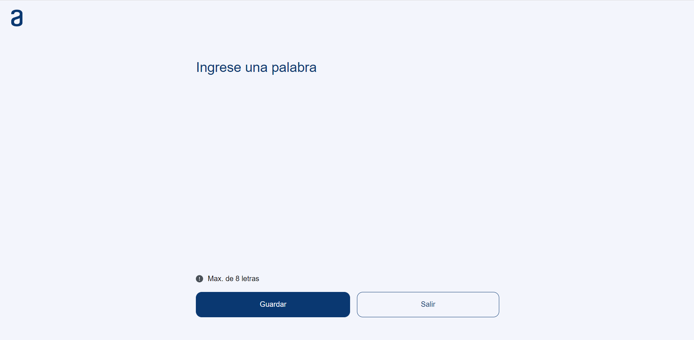
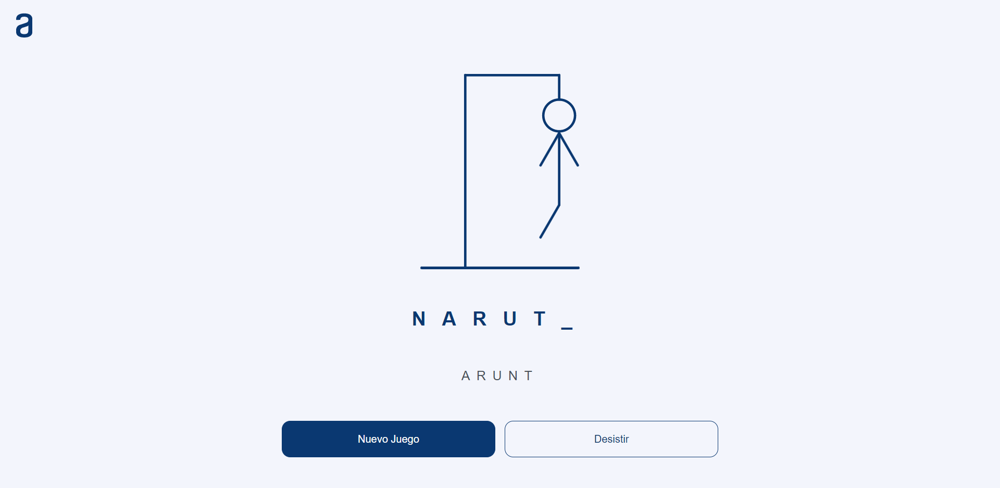
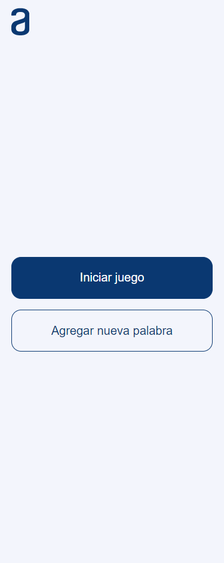
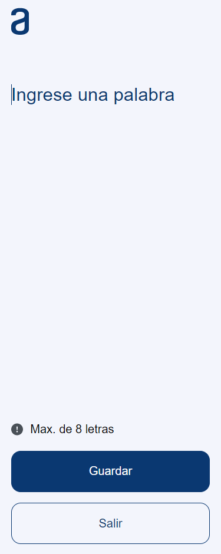
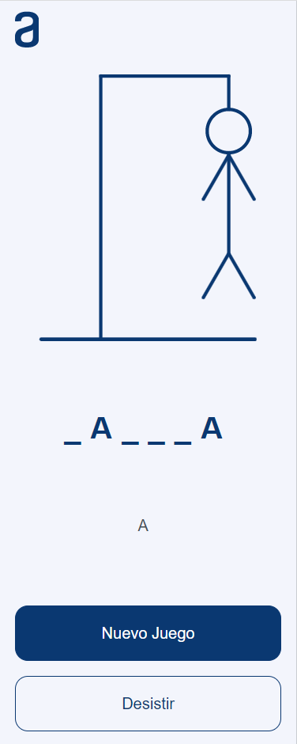

# Juego Ahorcado

El ahorcado es un juego en el que un jugador debe adivinar una palabra oculta adivinando las letras una por una. Si el jugador adivina una letra incorrecta, se dibuja una parte del cuerpo del ahorcado en la pantalla. El objetivo del jugador es adivinar la palabra antes de que se complete el dibujo del ahorcado.

  
  
  
  
  
  <a href='https://app.netlify.com/sites/juego-ahorcado-jaenfigueroa/deploys'></img></a>

## 📷 Capturas de pantalla

- ### 💻 Desktop

- ### 📱 Mobile

  
  
  

## 🛠️ Tecnologias usadas

</img>

## 🎨 Paleta de colores

  
  
  

## 🌐 Sitio web

Puedes empezar a probar el juego [aqui](https://juego-ahorcado-jaenfigueroa.netlify.app/).

